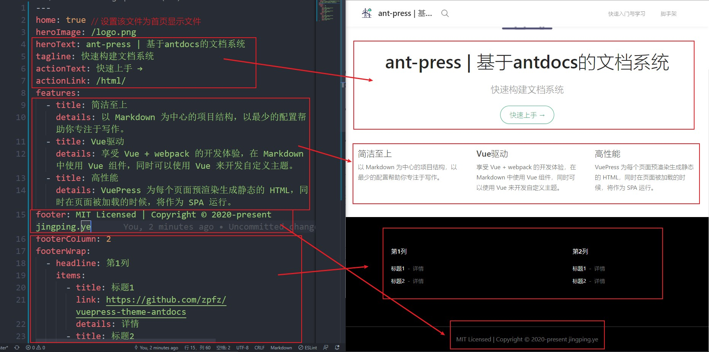

# 文档模板使用指南

> 基于 ant-docs 设计，支持 ant-design-vue ui 库。

## 前提

- 安装 node.js
- 安装 `npm`/`cnpm`

## 命令

> 如果安装速度很慢，可以切换为淘宝源，命令如下：
> `npm config set registry https://registry.npm.taobao.org`

- 安装

```bash
npm install

# or

cnpm install
```

- 运行

```bash
npm run dev
```

- 打包

```bash
npm run build
```

- 生成变更记录

```bash
npm run log
```

- 提交代码

```bash
npm run commit
```

- 预览打包后文件

```bash
npm run preview
```

## 目录结构说明

```text
|-- .vuepress 根配置
      |-- public
          |-- favicon.ico  // 标题栏使用icon,可替换
          |-- logo.png // 首页和其他页面用logo，可替换
      |-- styles
          |-- palette.less // 样式变量
          |-- style.less // 样式声明
      |-- config.js // 全局配置
      |-- enhanceApp.js // 组件库引入
|-- config // 导航与侧边栏配置
      |-- nav.js // 顶部导航栏配置
      |-- sidebar.js // 侧边栏配置
|-- css // 具体文档：css
|-- html // 具体文档:html
|-- README.md // 首页
|-- node_modules // npm 模块
|-- commitlint.config.js // git提交限制
|-- package.json // npm说明
|-- package-lock.json // npm说明
|-- docs 打包文件
```

## 配置

### 首页配置

> 注意与常用项目的区别，根目录下的 README 表示的即是首页

首页采用`YAML front matter`书写，下载项目之后，运行起来,可对照查看。


### logo 和 icon 配置

准备好图片，修改名称分别为`favicon.ico`和`logo.png`，替换`.vuepress\public`下文件即可。

### 顶部导航配置

> 位置为`/config/nav.js`

1. 名称解释:

- text: 名称
- link 名称显示的链接地址
- items 子项（如果有子导航地址）

2. 嵌套

如果有不断的子项，那么可以不断嵌套

### 侧边栏配置

> 位置为`config/sidebar.js`

当前文档系统为多页配置。即如以下配置，打开 html 链接，那么全部是 html 文件夹下的文件。

```js
const sidebar = {
  "/html/": [
    "", // 指向 /html/README.md
    "one ", // 指向 /html/one.md
  ],
  "/css/": [
    "", // 指向 /css/README.md
    "one", //  指向 /one/README.md
  ],
};
```

所有的页面默认以`#`一级标题作为侧边栏标题，如果要指定侧边栏标题，需要使用以下结构

```js
const sidebar = {
  "/html/": [
    {
      title: "HTML介绍", // 名称
      path: "/html/", // 路径
    },
    {
      title: "第一篇文章",
      path: "one",
    },
  ],
  "/css/": ["", "one"],
};
```

## 其他

### 搜索

> 默认只搜索标题，不搜索内置的内容

如果要提高搜索，可以在文档的开头加入`tag`，提高搜索的命中率。

```yaml
---
tags:
  - html
  - 介绍
  - 第一篇文章
---

```

## 参考

更多请参考:

- [vuepress](https://vuepress.vuejs.org/zh/)
- [antdocs](https://antdocs.seeyoz.cn/)
